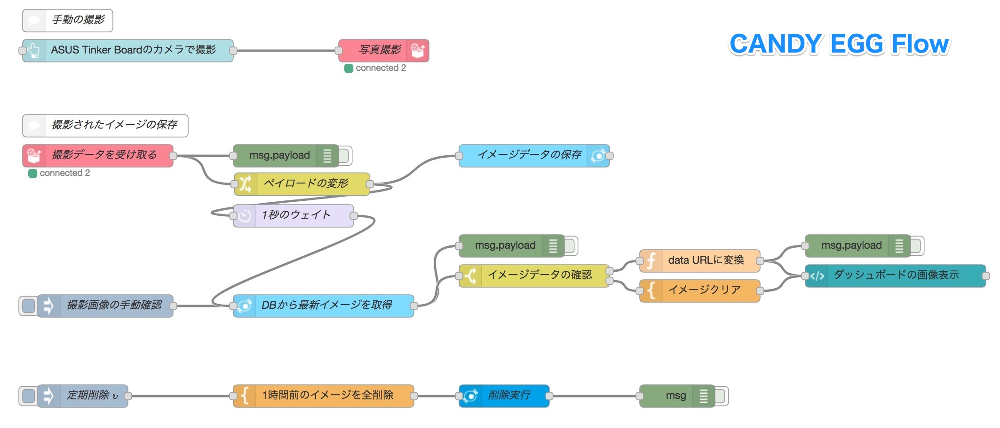
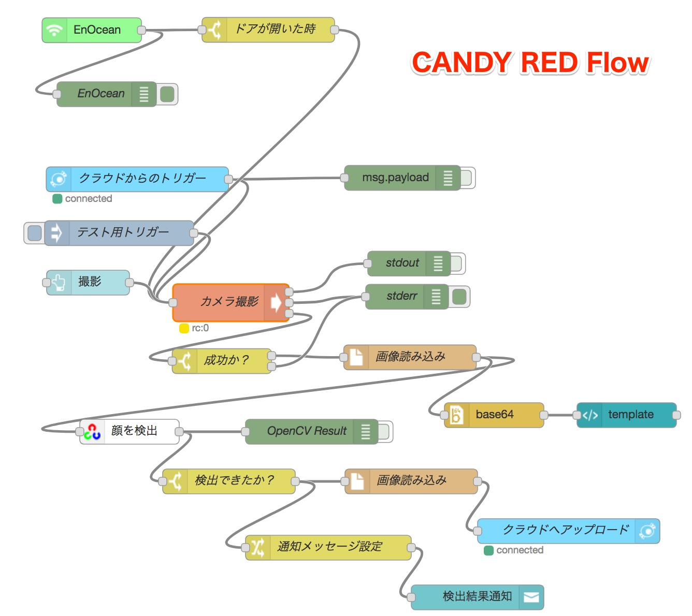

# このフローについて

このフローは、EnOceanのドア開閉検知センサーの動きに応じて、ASUS Tinker Boardに取り付けたカメラで静止画を撮影し、その静止画に人物の顔があるときだけクラウドにその画像をアップロードするというものです。クラウドでは、アップロードされた画像をデータベースに保存し、直近1時間分のデータを保持します。

ドア開閉検知センサーがない場合でも、クラウド側のダッシュボードに設置した撮影ボタンによって、任意のタイミングでカメラ撮影が可能になっています。

実際には、ドアを開けたタイミングですぐに撮影してもうまく映らなかったり、ちょうど良い位置にカメラを設置できないかもしれませんが、サンプルのフローということで実際に使用する場合は、このフローをベースにトライアンドエラーを行ってみてください。

# フローの一覧

1. [`candy-egg.json`](./candy-egg.json) ... `カメラ撮影`フロー。CANDY EGGからconect+のクラウドへデータを転送するフローです。
1. [`candy-red-atb.json`](./candy-red-atb.json) ... `カメラ撮影・顔検出`フロー。デバイス側のフローです。撮影時のコマンドにGStreamerを使用していますので、基本的にはASUS Tinker Board向けのフローです。ラズパイで利用する場合は、フローを一部変更すると利用することができます。

# 使い方

## CANDY EGGクラウド側

### 必要な機器
- ノートパソコンなどデスクトップブラウザーを利用できる環境

### カメラ撮影フロー

- フローファイル：[`candy-egg.json`](./candy-egg.json)

このフローでは、`CANDY RED`からWebsocketのAPI`/camera`を経由して入ってきたイメージデータを、MySQLのテーブル`iamges`へ保存します。このテーブルのデータは、あふれてしまわないように1時間経つと削除するようにしています。

一方、撮影されたデータは、ダッシュボードでも閲覧できるようにしています。データの保存のタイミングと保存されたデータの取得のタイミングが正確にコントロールできないので1秒の遅延を作って最新のデータをとって画面に表示できるようにしています。

#### このフローのポイント

撮影した画像をダッシュボードで表示するところは、HTMLの`img`タグで[`data URIs`](https://developer.mozilla.org/ja/docs/data_URIs)の機能を使って表示をしています。イメージが大きすぎると、ブラウザーによっては正しく表示できないことがあるようですが、FireFox、Chdrome、Safariでは特に問題なく表示できています。

## CANDY RED デバイス側

### 必要な機器

- ASUS Tinker Board
- [CANDY Pi Lite](https://www.candy-line.io/製品一覧/candy-pi-lite/)または[CANDY Pi Lite+](https://www.candy-line.io/製品一覧/candy-pi-lite-plus/)とnano SIMカード\*
- [ASUS Tinker Board用カメラモジュール](https://www.physical-computing.jp/product/1402)または[ASUS Tinker Board用赤外線カメラモジュール](https://www.physical-computing.jp/product/1409)
- [USB 400J EnOcean USB Gateway](https://www.zaikostore.com/zaikostore/stockDetail?stockID=st37705711&productName_forFind=USB400J&typeStock_forFind=all)（必須ではありません）
- [EnOcean 無線式ドア開閉センサー STM250J](https://www.switch-science.com/catalog/2549/)（必須ではありません）

\* W-Fiなどでもインターネットにつながれば利用できる場合がありますが、ProxyやFWの設定などによりクラウド側と通信できない場合がありますので基本的にはモバイルネットワークを利用してください。

### カメラ撮影・顔検出フロー

- フローファイル：[`candy-red.json`](./candy-red.json)

このフローでは、`CANDY EGG`のWebsocket API`/camera`へ接続し、撮影したイメージデータを送信したり、`CANDY EGG`からの撮影指示を受信したりします。

また、ネットに繋がないローカルでのテスト用に`CANDY RED`のダッシュボードでも撮影のテストを行えるようになっています。その場合は、ダッシュボード上にも撮影した画像が表示されます。

#### このフローのポイント

EnOceanによるドアセンサーをカメラ撮影の契機としています。カメラの設置場所をドアが開い所で人物の顔が見えそうな範囲を撮影できるところに置くような利用シーンを想定して作成しました。実際はブレてしまったりするかもしれませんが、ASUS Tinker Boardの純正カメラの中には赤外線対応しているものがありますので、暗所でもある程度機能する可能性もあります。

また、テスト用にブラウザーで`CANDY RED`にアクセスすることによって、手動で撮影できるようにもしています。この場合は、撮影した画像を判定して顔を検出できると、右上に「顔を検出しました！」というようなメッセージも数秒間表示されますので、どのような画像を顔として認識しているか色々試すことも可能です。試した限り、かなり顔の広い範囲が写っていないと判別されないようです。

本フローは、ASUS Tinker Board専用ですが、カメラ撮影ノードの箇所を変更することによって、ラズパイでも動作させることは可能です。是非工夫してみてください。

撮影した画像をダッシュボードで表示するところは、`CANDY EGG`と同様にHTMLの`img`タグで[`data URIs`](https://developer.mozilla.org/ja/docs/data_URIs)の機能を使って表示をしています。
