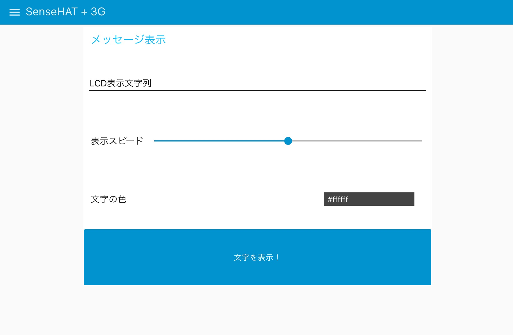
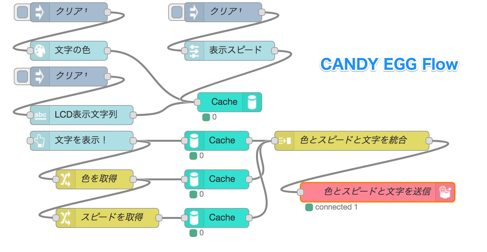
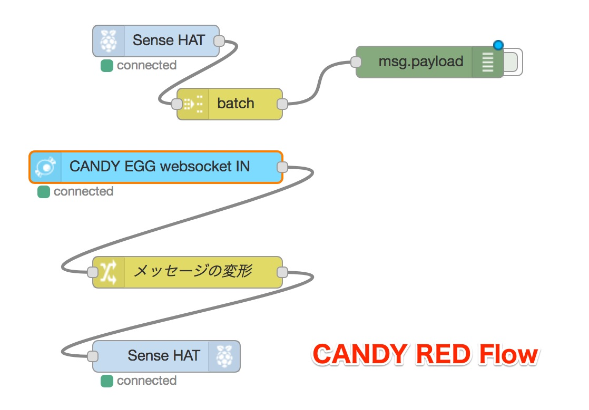

# このフローについて

このフローは、クラウドからSenseHATとCANDY Pi Liteを取り付けたRaspberry Piへ、表示したい文字、文字の色、表示スピードを指定してSenseHATのLCDに表示するものです。

クラウドの指示がSenseHATへ届く様子を確認することができます。一方で、SenseHATから受信できる温度・湿度などの情報は、単にdebugノードへ出力するだけとなっています。この部分を試行錯誤して、クラウド側へ送るなど工夫して試してみることが可能です。

表示したい文字、文字の色、表示スピードは、ダッシュボードと呼ばれる簡易のUI画面にて行います。ダッシュボードをユーザーインタフェースとする一例ですので、変更したりするなどしてダッシュボード機能の理解を深めてみてください。

# フローの一覧

1. [`candy-egg.json`](./candy-egg.json) ... `LCD表示`フロー。CANDY EGGからCANDY REDへ文字の内容、文字の色、表示スピードを送信するフローです。
1. [`candy-red-rpi.json`](./candy-red-rpi.json) ... `SenseHAT`フロー。デバイス側のフローです。SenseHATの機能を利用しているため、Raspberry Pi専用のフローとなります。

# 使い方

## CANDY EGGクラウド側

### 必要な機器
- ノートパソコンなどデスクトップブラウザーを利用できる環境

### カメラ撮影フロー

- フローファイル：[`candy-egg.json`](./candy-egg.json)

このフローでは、`CANDY EGG`のダッシュボード上で指定した文字、表示スピード、文字色を「文字を表示！」ボタンを押した契機で`CANDY RED`のWebsocketのAPI`/lcd`へ送信します。

#### このフローのポイント

「文字を表示！」ボタンを押してから`CANDY RED`へデータを送信するために、ダッシュボードで入力された情報を一時的にキャッシュへ溜めています。キャッシュを使うとこのように一時的にメモリー上にデータを保管できるので、あとで処理する場合など情報を保管をしたいときにキャッシュノードを使うと便利です。キャッシュノード以外にも一時的に情報を保管する方法はありますが、その場合はファンクションノードを使う必要が出てきますので、より簡便な方法としてキャッシュノードを取り上げています。

## CANDY RED デバイス側

### 必要な機器

- Raspberry Pi
- [CANDY Pi Lite](https://www.candy-line.io/製品一覧/candy-pi-lite/)または[CANDY Pi Lite+](https://www.candy-line.io/製品一覧/candy-pi-lite-plus/)とnano SIMカード\*
- [sensehat](https://www.raspberrypi.org/products/sense-hat/)

\* W-Fiなどでもインターネットにつながれば利用できる場合がありますが、ProxyやFWの設定などによりクラウド側と通信できない場合がありますので基本的にはモバイルネットワークを利用してください。

### SenseHATフロー

- フローファイル：[`candy-red-rpi.json`](./candy-red-rpi.json)

このフローでは、`CANDY EGG`のWebsocket API`/lcd`へ接続し、`CANDY EGG`から受信した情報を加工してSenseHATノードへ渡すことにより、SenseHATのLCDへ意図した文字表示を行うようになっています。

#### このフローのポイント

`CANDY EGG`から受信した情報はそのままではSenseHATに渡せません。このため、Changeノードを使用してデータの改変を行なっています。データの改変の仕方の方法をこのフローで見ることができます。
